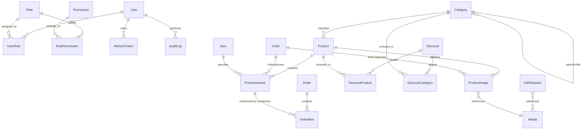

# Fashion Store — Database Architecture Specification

## Phase 2A: Database Architecture Design

This document provides the complete, production-grade database architecture specification for the Fashion Store platform. It defines all domain entities, relationships, constraints, indexes, deletion behaviors, and strategic decisions for the PostgreSQL database using Prisma ORM in subsequent phases.

---

## 1. Database Overview

The Fashion Store database is engineered specifically for a modern, high-performance, bilingual (Arabic & English) fashion retail platform. It prioritizes:

- **Domain Accuracy**: Clear separation between master products, inventory-holding variants, categories, and attributes (colors/sizes).
- **Historical Order Integrity**: Full price and product metadata snapshots on order items, ensuring historical fidelity regardless of future catalog updates or variant deletions.
- **Bilingual First-Class Support**: Explicit dual-language columns (`*Ar` and `*En`) on all domain entities for zero-join, high-performance querying and seamless Excel import/export.
- **Enterprise Security & Auditability**: Role-Based Access Control (RBAC), token rotation tracking, and comprehensive audit logs.
- **Zero Payment Risk**: Dedicated support for WhatsApp-driven order processing without premature payment gateway baggage.

---

## 2. Entity List & Classifications

The database comprises **18 core entities** structured into 6 logical domain boundaries:

| Entity Name          | Domain Boundary       | Storage Type | Primary Purpose                                                        |
| :------------------- | :-------------------- | :----------- | :--------------------------------------------------------------------- |
| **User**             | Identity & Access     | Table        | System administrators and staff members                                |
| **Role**             | Identity & Access     | Table        | Defined roles (`SUPER_ADMIN`, `ADMIN`, `STORE_MANAGER`, `SALES_AGENT`) |
| **Permission**       | Identity & Access     | Table        | Granular system permissions (`products.create`, `orders.update`, etc.) |
| **RolePermission**   | Identity & Access     | Table (Join) | Many-to-many role-to-permission mappings                               |
| **UserRole**         | Identity & Access     | Table (Join) | Many-to-many user-to-role assignments                                  |
| **RefreshToken**     | Identity & Access     | Table        | Cryptographic token hashes for JWT refresh rotation                    |
| **Category**         | Catalog Management    | Table        | Hierarchical product taxonomy with slug routing                        |
| **Color**            | Catalog Management    | Table        | Centralized color attribute dictionary with hex codes                  |
| **Size**             | Catalog Management    | Table        | Centralized garment size attribute dictionary                          |
| **Product**          | Catalog Management    | Table        | Master product records (bilingual descriptions, category, status)      |
| **ProductVariant**   | Catalog Management    | Table        | Purchasable SKU units (Color + Size + Price + Stock)                   |
| **ProductImage**     | Media & Catalog       | Table        | Product photography with color filtering & ordering metadata           |
| **Discount**         | Pricing & Promotions  | Table        | Configurable percentage/fixed promotions with scheduling               |
| **DiscountProduct**  | Pricing & Promotions  | Table (Join) | Target products linked to specific discounts                           |
| **DiscountCategory** | Pricing & Promotions  | Table (Join) | Target categories linked to specific discounts                         |
| **Order**            | Orders & WhatsApp     | Table        | Customer order records with contact & delivery details                 |
| **OrderItem**        | Orders & WhatsApp     | Table        | Order line items with immutable historical product snapshots           |
| **CMSSection**       | Content Management    | Table        | Dynamic homepage sections, hero banners, and collections               |
| **StoreSetting**     | Platform Config       | Table        | Key-value/typed store settings (branding, WhatsApp, social links)      |
| **Media**            | Media Assets          | Table        | Uploaded asset metadata (URL, dimensions, mime-type, storage provider) |
| **AuditLog**         | Governance & Security | Table        | Immutable audit trail for administrative operations                    |

---

## 3. Entity-Relationship Diagram (ERD)



---

## 4. Table-by-Table Specifications

---

### Entity: `User`

**Purpose**: Stores administrative accounts, credentials, and account statuses.

| Field          | Type           | Required | Unique | Default             | Description                                 |
| :------------- | :------------- | :------- | :----- | :------------------ | :------------------------------------------ |
| `id`           | `UUID`         | Yes      | Yes    | `gen_random_uuid()` | Primary Key                                 |
| `email`        | `VARCHAR(255)` | Yes      | Yes    | None                | Unique login email address                  |
| `passwordHash` | `VARCHAR(255)` | Yes      | No     | None                | Argon2id/Bcrypt password hash               |
| `fullName`     | `VARCHAR(150)` | Yes      | No     | None                | Full display name of the staff member       |
| `phone`        | `VARCHAR(30)`  | No       | No     | NULL                | Optional contact phone number               |
| `isActive`     | `BOOLEAN`      | Yes      | No     | `true`              | Account active/disabled flag                |
| `lastLoginAt`  | `TIMESTAMPTZ`  | No       | No     | NULL                | Timestamp of last successful authentication |
| `createdAt`    | `TIMESTAMPTZ`  | Yes      | No     | `NOW()`             | Account creation timestamp                  |
| `updatedAt`    | `TIMESTAMPTZ`  | Yes      | No     | `NOW()`             | Last profile update timestamp               |

- **Relationships**:
  - `User` 1:N `UserRole` (Cascade on user delete)
  - `User` 1:N `RefreshToken` (Cascade on user delete)
  - `User` 1:N `AuditLog` (Set NULL on user delete)
- **Indexes**:
  - `idx_users_email` (`email`)
  - `idx_users_is_active` (`isActive`)
- **Constraints**:
  - `uq_users_email`: UNIQUE(`email`)
- **Delete Behavior**: `RESTRICT` if user created audit records or soft-disable via `isActive = false`.

---

### Entity: `Role`

**Purpose**: Defines administrative and staff role tiers.

| Field           | Type           | Required | Unique | Default             | Description                                                              |
| :-------------- | :------------- | :------- | :----- | :------------------ | :----------------------------------------------------------------------- |
| `id`            | `UUID`         | Yes      | Yes    | `gen_random_uuid()` | Primary Key                                                              |
| `name`          | `VARCHAR(50)`  | Yes      | Yes    | None                | Unique role key (`SUPER_ADMIN`, `ADMIN`, `STORE_MANAGER`, `SALES_AGENT`) |
| `displayNameAr` | `VARCHAR(100)` | Yes      | No     | None                | Arabic display title                                                     |
| `displayNameEn` | `VARCHAR(100)` | Yes      | No     | None                | English display title                                                    |
| `description`   | `TEXT`         | No       | No     | NULL                | Description of responsibilities                                          |
| `isSystem`      | `BOOLEAN`      | Yes      | No     | `false`             | System roles cannot be deleted                                           |
| `createdAt`     | `TIMESTAMPTZ`  | Yes      | No     | `NOW()`             | Timestamp created                                                        |
| `updatedAt`     | `TIMESTAMPTZ`  | Yes      | No     | `NOW()`             | Timestamp updated                                                        |

- **Relationships**:
  - `Role` 1:N `UserRole` (Restrict on delete)
  - `Role` 1:N `RolePermission` (Cascade on role delete)
- **Indexes**:
  - `idx_roles_name` (`name`)
- **Constraints**:
  - `uq_roles_name`: UNIQUE(`name`)

---

### Entity: `Permission`

**Purpose**: Granular feature and action authorization tokens.

| Field         | Type           | Required | Unique | Default             | Description                                                  |
| :------------ | :------------- | :------- | :----- | :------------------ | :----------------------------------------------------------- |
| `id`          | `UUID`         | Yes      | Yes    | `gen_random_uuid()` | Primary Key                                                  |
| `name`        | `VARCHAR(100)` | Yes      | Yes    | None                | Permission slug (e.g., `products.create`, `orders.update`)   |
| `module`      | `VARCHAR(50)`  | Yes      | No     | None                | Functional group (`products`, `orders`, `settings`, `users`) |
| `description` | `TEXT`         | No       | No     | NULL                | Human readable explanation of permission                     |
| `createdAt`   | `TIMESTAMPTZ`  | Yes      | No     | `NOW()`             | Timestamp created                                            |

- **Constraints**:
  - `uq_permissions_name`: UNIQUE(`name`)

---

### Entity: `UserRole` & `RolePermission`

**Purpose**: Explicit join tables for RBAC flexibility.

#### `UserRole`:

- `userId` (`UUID`, Required, FK -> `User.id` ON DELETE CASCADE)
- `roleId` (`UUID`, Required, FK -> `Role.id` ON DELETE CASCADE)
- **Primary Key / Composite Unique**: `PRIMARY KEY (userId, roleId)`

#### `RolePermission`:

- `roleId` (`UUID`, Required, FK -> `Role.id` ON DELETE CASCADE)
- `permissionId` (`UUID`, Required, FK -> `Permission.id` ON DELETE CASCADE)
- **Primary Key / Composite Unique**: `PRIMARY KEY (roleId, permissionId)`

---

### Entity: `RefreshToken`

**Purpose**: Manages JWT refresh tokens, rotation, and revocation for administrative sessions.

| Field       | Type           | Required | Unique | Default             | Description                    |
| :---------- | :------------- | :------- | :----- | :------------------ | :----------------------------- |
| `id`        | `UUID`         | Yes      | Yes    | `gen_random_uuid()` | Primary Key                    |
| `userId`    | `UUID`         | Yes      | No     | None                | FK -> `User.id`                |
| `tokenHash` | `VARCHAR(255)` | Yes      | Yes    | None                | SHA-256 hash of refresh token  |
| `userAgent` | `VARCHAR(255)` | No       | No     | NULL                | Client browser/device metadata |
| `ipAddress` | `VARCHAR(45)`  | No       | No     | NULL                | IPv4/IPv6 client address       |
| `expiresAt` | `TIMESTAMPTZ`  | Yes      | No     | None                | Token expiry timestamp         |
| `revokedAt` | `TIMESTAMPTZ`  | No       | No     | NULL                | Timestamp if revoked           |
| `createdAt` | `TIMESTAMPTZ`  | Yes      | No     | `NOW()`             | Creation timestamp             |

- **Indexes**:
  - `idx_refresh_tokens_user_id` (`userId`)
  - `idx_refresh_tokens_token_hash` (`tokenHash`)
  - `idx_refresh_tokens_expires_at` (`expiresAt`)

---

### Entity: `Category`

**Purpose**: Product classification hierarchy with localized naming, slug routing, and display ordering.

| Field           | Type           | Required | Unique | Default             | Description                             |
| :-------------- | :------------- | :------- | :----- | :------------------ | :-------------------------------------- |
| `id`            | `UUID`         | Yes      | Yes    | `gen_random_uuid()` | Primary Key                             |
| `parentId`      | `UUID`         | No       | No     | NULL                | FK -> `Category.id` (for subcategories) |
| `nameAr`        | `VARCHAR(100)` | Yes      | No     | None                | Arabic category name (e.g., 'فساتين')   |
| `nameEn`        | `VARCHAR(100)` | Yes      | No     | None                | English category name (e.g., 'Dresses') |
| `slug`          | `VARCHAR(120)` | Yes      | Yes    | None                | SEO-friendly URL slug                   |
| `descriptionAr` | `TEXT`         | No       | No     | NULL                | Arabic description                      |
| `descriptionEn` | `TEXT`         | No       | No     | NULL                | English description                     |
| `imageUrl`      | `TEXT`         | No       | No     | NULL                | Category tile/banner image URL          |
| `displayOrder`  | `INTEGER`      | Yes      | No     | `0`                 | Sort position on storefront/navigation  |
| `isActive`      | `BOOLEAN`      | Yes      | No     | `true`              | Category visibility toggle              |
| `createdAt`     | `TIMESTAMPTZ`  | Yes      | No     | `NOW()`             | Timestamp created                       |
| `updatedAt`     | `TIMESTAMPTZ`  | Yes      | No     | `NOW()`             | Timestamp updated                       |

- **Relationships**:
  - `Category` 1:N `Category` (self-relation, `parentId`, ON DELETE SET NULL)
  - `Category` 1:N `Product` (ON DELETE RESTRICT)
- **Indexes**:
  - `idx_categories_slug` (`slug`)
  - `idx_categories_parent_id` (`parentId`)
  - `idx_categories_display_order` (`displayOrder`)
  - `idx_categories_is_active` (`isActive`)
- **Constraints**:
  - `uq_categories_slug`: UNIQUE(`slug`)

---

### Entity: `Color`

**Purpose**: Standardized garment color palette with visual hex representation.

| Field          | Type          | Required | Unique | Default             | Description                              |
| :------------- | :------------ | :------- | :----- | :------------------ | :--------------------------------------- |
| `id`           | `UUID`        | Yes      | Yes    | `gen_random_uuid()` | Primary Key                              |
| `nameAr`       | `VARCHAR(50)` | Yes      | No     | None                | Arabic color name (e.g., 'أسود ملكي')    |
| `nameEn`       | `VARCHAR(50)` | Yes      | No     | None                | English color name (e.g., 'Royal Black') |
| `hexCode`      | `VARCHAR(7)`  | Yes      | No     | None                | Hexadecimal color code (e.g., '#1A1A1A') |
| `displayOrder` | `INTEGER`     | Yes      | No     | `0`                 | Ordering in color swatch lists           |
| `isActive`     | `BOOLEAN`     | Yes      | No     | `true`              | Visibility toggle                        |
| `createdAt`    | `TIMESTAMPTZ` | Yes      | No     | `NOW()`             | Timestamp created                        |
| `updatedAt`    | `TIMESTAMPTZ` | Yes      | No     | `NOW()`             | Timestamp updated                        |

- **Relationships**:
  - `Color` 1:N `ProductVariant` (ON DELETE RESTRICT)
  - `Color` 1:N `ProductImage` (ON DELETE SET NULL)
- **Constraints**:
  - `chk_colors_hex_format`: `hexCode ~* '^#[0-9A-Fa-f]{6}$'`

---

### Entity: `Size`

**Purpose**: Standardized garment sizing system.

| Field          | Type          | Required | Unique | Default             | Description                                            |
| :------------- | :------------ | :------- | :----- | :------------------ | :----------------------------------------------------- |
| `id`           | `UUID`        | Yes      | Yes    | `gen_random_uuid()` | Primary Key                                            |
| `nameAr`       | `VARCHAR(30)` | Yes      | No     | None                | Arabic size label (e.g., 'صغير (S)')                   |
| `nameEn`       | `VARCHAR(30)` | Yes      | No     | None                | English size label (e.g., 'S', 'M', 'XL', 'Free Size') |
| `displayOrder` | `INTEGER`     | Yes      | No     | `0`                 | Sorting order in size selectors                        |
| `isActive`     | `BOOLEAN`     | Yes      | No     | `true`              | Visibility toggle                                      |
| `createdAt`    | `TIMESTAMPTZ` | Yes      | No     | `NOW()`             | Timestamp created                                      |
| `updatedAt`    | `TIMESTAMPTZ` | Yes      | No     | `NOW()`             | Timestamp updated                                      |

- **Relationships**:
  - `Size` 1:N `ProductVariant` (ON DELETE RESTRICT)

---

### Entity: `Product`

**Purpose**: Master catalog entity representing the abstract garment/product.

| Field           | Type            | Required | Unique | Default             | Description                                      |
| :-------------- | :-------------- | :------- | :----- | :------------------ | :----------------------------------------------- |
| `id`            | `UUID`          | Yes      | Yes    | `gen_random_uuid()` | Primary Key                                      |
| `categoryId`    | `UUID`          | Yes      | No     | None                | FK -> `Category.id`                              |
| `nameAr`        | `VARCHAR(200)`  | Yes      | No     | None                | Arabic product title                             |
| `nameEn`        | `VARCHAR(200)`  | Yes      | No     | None                | English product title                            |
| `slug`          | `VARCHAR(220)`  | Yes      | Yes    | None                | Unique URL slug                                  |
| `descriptionAr` | `TEXT`          | No       | No     | NULL                | Rich Arabic description / fabric details         |
| `descriptionEn` | `TEXT`          | No       | No     | NULL                | Rich English description / fabric details        |
| `basePrice`     | `DECIMAL(10,2)` | Yes      | No     | None                | Standard base price in primary currency          |
| `isFeatured`    | `BOOLEAN`       | Yes      | No     | `false`             | Featured collection editorial flag               |
| `isActive`      | `BOOLEAN`       | Yes      | No     | `true`              | Storefront visibility toggle                     |
| `seoTitleAr`    | `VARCHAR(150)`  | No       | No     | NULL                | Custom SEO title in Arabic                       |
| `seoTitleEn`    | `VARCHAR(150)`  | No       | No     | NULL                | Custom SEO title in English                      |
| `seoDescAr`     | `VARCHAR(255)`  | No       | No     | NULL                | Meta description in Arabic                       |
| `seoDescEn`     | `VARCHAR(255)`  | No       | No     | NULL                | Meta description in English                      |
| `deletedAt`     | `TIMESTAMPTZ`   | No       | No     | NULL                | Soft-deletion timestamp for historical integrity |
| `createdAt`     | `TIMESTAMPTZ`   | Yes      | No     | `NOW()`             | Creation timestamp                               |
| `updatedAt`     | `TIMESTAMPTZ`   | Yes      | No     | `NOW()`             | Last update timestamp                            |

- **Relationships**:
  - `Product` N:1 `Category` (ON DELETE RESTRICT)
  - `Product` 1:N `ProductVariant` (ON DELETE CASCADE on hard delete, normally soft deleted)
  - `Product` 1:N `ProductImage` (ON DELETE CASCADE)
- **Indexes**:
  - `idx_products_slug` (`slug`)
  - `idx_products_category_id` (`categoryId`)
  - `idx_products_is_active` (`isActive`)
  - `idx_products_is_featured` (`isFeatured`)
  - `idx_products_deleted_at` (`deletedAt`)
- **Constraints**:
  - `uq_products_slug`: UNIQUE(`slug`)
  - `chk_products_base_price_positive`: `basePrice >= 0`

---

### Entity: `ProductVariant`

**Purpose**: The actual stock-holding, purchasable SKU unit combining Color + Size.

| Field               | Type            | Required | Unique | Default             | Description                                       |
| :------------------ | :-------------- | :------- | :----- | :------------------ | :------------------------------------------------ |
| `id`                | `UUID`          | Yes      | Yes    | `gen_random_uuid()` | Primary Key                                       |
| `productId`         | `UUID`          | Yes      | No     | None                | FK -> `Product.id`                                |
| `colorId`           | `UUID`          | Yes      | No     | None                | FK -> `Color.id`                                  |
| `sizeId`            | `UUID`          | Yes      | No     | None                | FK -> `Size.id`                                   |
| `sku`               | `VARCHAR(50)`   | Yes      | Yes    | None                | Unique Stock Keeping Unit code                    |
| `price`             | `DECIMAL(10,2)` | Yes      | No     | None                | Variant price (equals or overrides basePrice)     |
| `compareAtPrice`    | `DECIMAL(10,2)` | No       | No     | NULL                | Original price for strikethrough discount display |
| `stockQuantity`     | `INTEGER`       | Yes      | No     | `0`                 | Available stock count                             |
| `lowStockThreshold` | `INTEGER`       | Yes      | No     | `5`                 | Warning threshold for admin dashboard             |
| `isActive`          | `BOOLEAN`       | Yes      | No     | `true`              | Variant availability toggle                       |
| `createdAt`         | `TIMESTAMPTZ`   | Yes      | No     | `NOW()`             | Creation timestamp                                |
| `updatedAt`         | `TIMESTAMPTZ`   | Yes      | No     | `NOW()`             | Last update timestamp                             |

- **Relationships**:
  - `ProductVariant` N:1 `Product` (ON DELETE CASCADE)
  - `ProductVariant` N:1 `Color` (ON DELETE RESTRICT)
  - `ProductVariant` N:1 `Size` (ON DELETE RESTRICT)
  - `ProductVariant` 1:N `OrderItem` (ON DELETE RESTRICT)
- **Indexes**:
  - `idx_variants_sku` (`sku`)
  - `idx_variants_product_id` (`productId`)
  - `idx_variants_stock_quantity` (`stockQuantity`)
- **Constraints**:
  - `uq_variants_sku`: UNIQUE(`sku`)
  - `uq_variants_product_color_size`: UNIQUE(`productId`, `colorId`, `sizeId`)
  - `chk_variants_price_positive`: `price >= 0`
  - `chk_variants_stock_non_negative`: `stockQuantity >= 0`

---

### Entity: `ProductImage`

**Purpose**: Manages multi-image photography galleries for products, with optional color-filtering affinity.

| Field          | Type           | Required | Unique | Default             | Description                                            |
| :------------- | :------------- | :------- | :----- | :------------------ | :----------------------------------------------------- |
| `id`           | `UUID`         | Yes      | Yes    | `gen_random_uuid()` | Primary Key                                            |
| `productId`    | `UUID`         | Yes      | No     | None                | FK -> `Product.id`                                     |
| `colorId`      | `UUID`         | No       | No     | NULL                | FK -> `Color.id` (optional filter per color selection) |
| `url`          | `TEXT`         | Yes      | No     | None                | Direct image URL or CDN path                           |
| `altTextAr`    | `VARCHAR(200)` | No       | No     | NULL                | Localized Arabic image alt text                        |
| `altTextEn`    | `VARCHAR(200)` | No       | No     | NULL                | Localized English image alt text                       |
| `displayOrder` | `INTEGER`      | Yes      | No     | `0`                 | Display sequence                                       |
| `isPrimary`    | `BOOLEAN`      | Yes      | No     | `false`             | Main thumbnail representation                          |
| `createdAt`    | `TIMESTAMPTZ`  | Yes      | No     | `NOW()`             | Creation timestamp                                     |

- **Indexes**:
  - `idx_product_images_product_id` (`productId`)
  - `idx_product_images_color_id` (`colorId`)
  - `idx_product_images_is_primary` (`isPrimary`)

---

### Entity: `Discount`

**Purpose**: Configurable promotional discount engine supporting percentage and fixed value deductions.

| Field        | Type            | Required | Unique | Default             | Description                                            |
| :----------- | :-------------- | :------- | :----- | :------------------ | :----------------------------------------------------- |
| `id`         | `UUID`          | Yes      | Yes    | `gen_random_uuid()` | Primary Key                                            |
| `nameAr`     | `VARCHAR(100)`  | Yes      | No     | None                | Promotional campaign Arabic name                       |
| `nameEn`     | `VARCHAR(100)`  | Yes      | No     | None                | Promotional campaign English name                      |
| `type`       | `VARCHAR(20)`   | Yes      | No     | None                | `PERCENTAGE` or `FIXED_AMOUNT`                         |
| `value`      | `DECIMAL(10,2)` | Yes      | No     | None                | Discount magnitude (e.g., 20.00 for 20% or 100.00 EGP) |
| `startDate`  | `TIMESTAMPTZ`   | Yes      | No     | None                | Campaign activation timestamp                          |
| `endDate`    | `TIMESTAMPTZ`   | No       | No     | NULL                | Optional expiry timestamp (NULL = indefinite)          |
| `isActive`   | `BOOLEAN`       | Yes      | No     | `true`              | Global manual enable/disable toggle                    |
| `applyToAll` | `BOOLEAN`       | Yes      | No     | `false`             | If true, applies store-wide across all catalog items   |
| `createdAt`  | `TIMESTAMPTZ`   | Yes      | No     | `NOW()`             | Creation timestamp                                     |
| `updatedAt`  | `TIMESTAMPTZ`   | Yes      | No     | `NOW()`             | Last update timestamp                                  |

- **Relationships**:
  - `Discount` 1:N `DiscountProduct` (ON DELETE CASCADE)
  - `Discount` 1:N `DiscountCategory` (ON DELETE CASCADE)
- **Constraints**:
  - `chk_discount_value_positive`: `value > 0`

---

### Entity: `Order`

**Purpose**: Central order entity recording customer communication, delivery location, and WhatsApp order reference.

| Field             | Type            | Required | Unique | Default             | Description                                                                                |
| :---------------- | :-------------- | :------- | :----- | :------------------ | :----------------------------------------------------------------------------------------- |
| `id`              | `UUID`          | Yes      | Yes    | `gen_random_uuid()` | Primary Key                                                                                |
| `orderNumber`     | `VARCHAR(30)`   | Yes      | Yes    | None                | Human-readable reference (e.g., `ORD-2026-10492`)                                          |
| `customerName`    | `VARCHAR(150)`  | Yes      | No     | None                | Customer full name                                                                         |
| `customerPhone`   | `VARCHAR(30)`   | Yes      | No     | None                | Customer WhatsApp / Phone number                                                           |
| `customerCity`    | `VARCHAR(100)`  | No       | No     | NULL                | Delivery city / region                                                                     |
| `customerAddress` | `TEXT`          | No       | No     | NULL                | Delivery street address                                                                    |
| `notes`           | `TEXT`          | No       | No     | NULL                | Customer or administrative notes                                                           |
| `status`          | `VARCHAR(30)`   | Yes      | No     | `'PENDING'`         | Order status (`PENDING`, `CONTACTED`, `CONFIRMED`, `PROCESSING`, `COMPLETED`, `CANCELLED`) |
| `totalAmount`     | `DECIMAL(10,2)` | Yes      | No     | None                | Aggregated total order value at submission                                                 |
| `currency`        | `VARCHAR(10)`   | Yes      | No     | `'EGP'`             | Currency code                                                                              |
| `whatsappMessage` | `TEXT`          | No       | No     | NULL                | Snapshot of the exact WhatsApp message generated                                           |
| `createdAt`       | `TIMESTAMPTZ`   | Yes      | No     | `NOW()`             | Order submission timestamp                                                                 |
| `updatedAt`       | `TIMESTAMPTZ`   | Yes      | No     | `NOW()`             | Status update timestamp                                                                    |

- **Relationships**:
  - `Order` 1:N `OrderItem` (ON DELETE CASCADE)
- **Indexes**:
  - `idx_orders_order_number` (`orderNumber`)
  - `idx_orders_customer_phone` (`customerPhone`)
  - `idx_orders_status` (`status`)
  - `idx_orders_created_at` (`createdAt`)
- **Constraints**:
  - `uq_orders_order_number`: UNIQUE(`orderNumber`)
  - `chk_orders_total_positive`: `totalAmount >= 0`

---

### Entity: `OrderItem`

**Purpose**: Order line item holding an **immutable historical snapshot** of purchased variant, prices, and names.

| Field           | Type            | Required | Unique | Default             | Description                                              |
| :-------------- | :-------------- | :------- | :----- | :------------------ | :------------------------------------------------------- |
| `id`            | `UUID`          | Yes      | Yes    | `gen_random_uuid()` | Primary Key                                              |
| `orderId`       | `UUID`          | Yes      | No     | None                | FK -> `Order.id`                                         |
| `variantId`     | `UUID`          | No       | No     | NULL                | FK -> `ProductVariant.id` (NULL if variant later purged) |
| `skuSnapshot`   | `VARCHAR(50)`   | Yes      | No     | None                | Immutable SKU at moment of purchase                      |
| `productNameAr` | `VARCHAR(200)`  | Yes      | No     | None                | Historical Arabic product title                          |
| `productNameEn` | `VARCHAR(200)`  | Yes      | No     | None                | Historical English product title                         |
| `colorNameAr`   | `VARCHAR(50)`   | Yes      | No     | None                | Historical Arabic color title                            |
| `colorNameEn`   | `VARCHAR(50)`   | Yes      | No     | None                | Historical English color title                           |
| `sizeNameAr`    | `VARCHAR(30)`   | Yes      | No     | None                | Historical Arabic size label                             |
| `sizeNameEn`    | `VARCHAR(30)`   | Yes      | No     | None                | Historical English size label                            |
| `unitPrice`     | `DECIMAL(10,2)` | Yes      | No     | None                | Historical unit price at moment of purchase              |
| `quantity`      | `INTEGER`       | Yes      | No     | `1`                 | Number of units ordered                                  |
| `subtotal`      | `DECIMAL(10,2)` | Yes      | No     | None                | `unitPrice * quantity` snapshot                          |
| `createdAt`     | `TIMESTAMPTZ`   | Yes      | No     | `NOW()`             | Timestamp created                                        |

- **Relationships**:
  - `OrderItem` N:1 `Order` (ON DELETE CASCADE)
  - `OrderItem` N:1 `ProductVariant` (ON DELETE SET NULL / RESTRICT)
- **Indexes**:
  - `idx_order_items_order_id` (`orderId`)
  - `idx_order_items_variant_id` (`variantId`)
  - `idx_order_items_sku_snapshot` (`skuSnapshot`)
- **Constraints**:
  - `chk_order_items_qty_positive`: `quantity > 0`
  - `chk_order_items_price_positive`: `unitPrice >= 0`

---

### Entity: `CMSSection`

**Purpose**: Dynamic homepage layout builder allowing dashboard control over banners, sliders, and featured collections.

| Field          | Type           | Required | Unique | Default             | Description                                                         |
| :------------- | :------------- | :------- | :----- | :------------------ | :------------------------------------------------------------------ |
| `id`           | `UUID`         | Yes      | Yes    | `gen_random_uuid()` | Primary Key                                                         |
| `key`          | `VARCHAR(60)`  | Yes      | Yes    | None                | Section key (e.g., `hero_slider`, `summer_promo`)                   |
| `type`         | `VARCHAR(30)`  | Yes      | No     | None                | `HERO_SLIDER`, `PROMO_BANNER`, `FEATURED_GRID`, `CATEGORY_CAROUSEL` |
| `titleAr`      | `VARCHAR(150)` | No       | No     | NULL                | Localized Arabic heading                                            |
| `titleEn`      | `VARCHAR(150)` | No       | No     | NULL                | Localized English heading                                           |
| `subtitleAr`   | `VARCHAR(255)` | No       | No     | NULL                | Localized Arabic sub-heading                                        |
| `subtitleEn`   | `VARCHAR(255)` | No       | No     | NULL                | Localized English sub-heading                                       |
| `payload`      | `JSONB`        | Yes      | No     | `'{}'::jsonb`       | Structured configuration (slides, images, links, product IDs)       |
| `displayOrder` | `INTEGER`      | Yes      | No     | `0`                 | Position on the homepage                                            |
| `isActive`     | `BOOLEAN`      | Yes      | No     | `true`              | Display toggle                                                      |
| `createdAt`    | `TIMESTAMPTZ`  | Yes      | No     | `NOW()`             | Timestamp created                                                   |
| `updatedAt`    | `TIMESTAMPTZ`  | Yes      | No     | `NOW()`             | Timestamp updated                                                   |

- **Indexes**:
  - `idx_cms_sections_key` (`key`)
  - `idx_cms_sections_display_order` (`displayOrder`)
  - `idx_cms_sections_is_active` (`isActive`)
- **Constraints**:
  - `uq_cms_sections_key`: UNIQUE(`key`)

---

### Entity: `StoreSetting`

**Purpose**: Key-value/typed configuration records for dynamic branding, WhatsApp numbers, and social links.

| Field       | Type          | Required | Unique | Default             | Description                                                    |
| :---------- | :------------ | :------- | :----- | :------------------ | :------------------------------------------------------------- |
| `id`        | `UUID`        | Yes      | Yes    | `gen_random_uuid()` | Primary Key                                                    |
| `key`       | `VARCHAR(80)` | Yes      | Yes    | None                | Setting identifier (e.g., `whatsapp_number`, `store_name`)     |
| `value`     | `TEXT`        | Yes      | No     | None                | String representation or serialized JSON                       |
| `group`     | `VARCHAR(40)` | Yes      | No     | `'GENERAL'`         | Setting category (`GENERAL`, `BRANDING`, `WHATSAPP`, `SOCIAL`) |
| `isPublic`  | `BOOLEAN`     | Yes      | No     | `true`              | If true, exposed to storefront API without authentication      |
| `updatedAt` | `TIMESTAMPTZ` | Yes      | No     | `NOW()`             | Last update timestamp                                          |

- **Indexes**:
  - `idx_store_settings_key` (`key`)
  - `idx_store_settings_group` (`group`)
- **Constraints**:
  - `uq_store_settings_key`: UNIQUE(`key`)

---

### Entity: `Media`

**Purpose**: Central media asset catalog recording upload metadata (dimensions, file size, storage provider).

| Field              | Type           | Required | Unique | Default             | Description                        |
| :----------------- | :------------- | :------- | :----- | :------------------ | :--------------------------------- |
| `id`               | `UUID`         | Yes      | Yes    | `gen_random_uuid()` | Primary Key                        |
| `url`              | `TEXT`         | Yes      | No     | None                | Public URL or CDN path             |
| `storageProvider`  | `VARCHAR(30)`  | Yes      | No     | `'LOCAL'`           | `LOCAL`, `S3`, `CLOUDINARY`, `GCS` |
| `storageKey`       | `VARCHAR(255)` | No       | No     | NULL                | Provider-specific file identifier  |
| `mimeType`         | `VARCHAR(60)`  | Yes      | No     | None                | e.g., `image/webp`, `image/jpeg`   |
| `fileSize`         | `INTEGER`      | Yes      | No     | None                | Size in bytes                      |
| `width`            | `INTEGER`      | No       | No     | NULL                | Image pixel width                  |
| `height`           | `INTEGER`      | No       | No     | NULL                | Image pixel height                 |
| `altTextAr`        | `VARCHAR(200)` | No       | No     | NULL                | Localized Arabic alt text          |
| `altTextEn`        | `VARCHAR(200)` | No       | No     | NULL                | Localized English alt text         |
| `uploadedByUserId` | `UUID`         | No       | No     | NULL                | FK -> `User.id`                    |
| `createdAt`        | `TIMESTAMPTZ`  | Yes      | No     | `NOW()`             | Upload timestamp                   |

- **Relationships**:
  - `Media` N:1 `User` (ON DELETE SET NULL)
- **Indexes**:
  - `idx_media_storage_provider` (`storageProvider`)
  - `idx_media_created_at` (`createdAt`)

---

### Entity: `AuditLog`

**Purpose**: Security and compliance log tracking critical administrative mutations.

| Field       | Type           | Required | Unique | Default             | Description                                                       |
| :---------- | :------------- | :------- | :----- | :------------------ | :---------------------------------------------------------------- |
| `id`        | `UUID`         | Yes      | Yes    | `gen_random_uuid()` | Primary Key                                                       |
| `userId`    | `UUID`         | No       | No     | NULL                | FK -> `User.id` (NULL if system action or user removed)           |
| `action`    | `VARCHAR(50)`  | Yes      | No     | None                | Action identifier (e.g., `PRODUCT_UPDATE`, `ORDER_STATUS_CHANGE`) |
| `entity`    | `VARCHAR(50)`  | Yes      | No     | None                | Affected entity type (e.g., `Product`, `Order`)                   |
| `entityId`  | `VARCHAR(100)` | Yes      | No     | None                | Identifier of affected record                                     |
| `oldValues` | `JSONB`        | No       | No     | NULL                | Diff snapshot before mutation                                     |
| `newValues` | `JSONB`        | No       | No     | NULL                | Diff snapshot after mutation                                      |
| `ipAddress` | `VARCHAR(45)`  | No       | No     | NULL                | Client IP address                                                 |
| `userAgent` | `VARCHAR(255)` | No       | No     | NULL                | Client user agent                                                 |
| `createdAt` | `TIMESTAMPTZ`  | Yes      | No     | `NOW()`             | Timestamp of operation                                            |

- **Indexes**:
  - `idx_audit_logs_user_id` (`userId`)
  - `idx_audit_logs_action` (`action`)
  - `idx_audit_logs_entity_entity_id` (`entity`, `entityId`)
  - `idx_audit_logs_created_at` (`createdAt`)

---

## 5. Architectural & Strategy Decisions

### 5.1. Localization Strategy

- **Decision**: Structured bilingual columns on domain entities (`nameAr` / `nameEn`, `descriptionAr` / `descriptionEn`) combined with typed `JSONB` payloads for dynamic CMS widgets.
- **Rationale**:
  1. _Zero Join Overhead_: Queries for catalog listing and details retrieve both locales in a single query row.
  2. _Strict Type Safety_: Prisma generates explicit TypeScript types for every field without requiring generic JSON parsing on primary entities.
  3. _Excel Compatibility_: Spreadsheet import/export directly maps columns (`Name (Arabic)`, `Name (English)`) without complex relational pivoting.
  4. _Full-Text Search_: Direct GIN or B-tree indexing on `nameAr` and `nameEn` is straightforward in PostgreSQL.

### 5.2. Inventory & Stock Management Strategy

- **Decision**: Single-store variant-level stock count with strict non-negative check constraints (`stockQuantity >= 0`) and low-stock alert thresholds.
- **Future Extensibility**: If multi-warehouse or branch-level inventory is required in future releases, a `Warehouse` and `StockLevel` entity can be introduced without breaking `ProductVariant` consumers, where `ProductVariant.stockQuantity` becomes a computed view of aggregated warehouse stocks.

### 5.3. Discount & Pricing Engine Strategy

- **Decision**: Dual pricing mechanics:
  1. _Direct Variant `compareAtPrice`_: Immediate strikethrough visual discounting for clearance and catalog sales without campaign overhead.
  2. _Scheduled `Discount` Campaigns_: Time-bounded promotions targeting specific products, categories, or store-wide orders.
- **Calculation Rule**: The active effective price is calculated via a centralized service function:
  ```typescript
  effectivePrice = Math.min(variant.price, applyDiscounts(variant, activeDiscounts));
  ```
  This prevents storing inconsistent or stale calculated prices across database rows.

### 5.4. Best Sellers vs. Featured Products

- **Featured Products**: Business/editorial selection marked via `Product.isFeatured = true` or explicitly curated in `CMSSection.payload`.
- **Best Sellers**: Empirical data derived from aggregated `OrderItem.quantity` across completed orders in a specified timeframe (e.g., past 30 days). Query pattern:
  ```sql
  SELECT oi."skuSnapshot", SUM(oi.quantity) as total_sold
  FROM "OrderItem" oi
  JOIN "Order" o ON oi."orderId" = o.id
  WHERE o.status = 'COMPLETED' AND o."createdAt" >= NOW() - INTERVAL '30 days'
  GROUP BY oi."skuSnapshot"
  ORDER BY total_sold DESC
  LIMIT 10;
  ```

### 5.5. Order Historical Integrity Strategy

- **Decision**: Comprehensive snapshot columns on `OrderItem` (`productNameAr`, `productNameEn`, `colorNameAr`, `sizeNameAr`, `unitPrice`, `subtotal`, `skuSnapshot`).
- **Rationale**: Products evolve, variants get renamed, prices change, and discontinued colors get archived. By capturing an immutable snapshot at checkout, invoices, order histories, and audit records remain 100% accurate forever, completely immune to future catalog modifications.

### 5.6. Excel Bulk Import / Export Architecture

- The catalog schema cleanly decomposes into standard spreadsheet columns:
  - `SKU`, `Category Slug`, `Name (AR)`, `Name (EN)`, `Description (AR)`, `Description (EN)`, `Color (EN)`, `Color (AR)`, `Color Hex`, `Size`, `Base Price`, `Variant Price`, `Compare At Price`, `Stock`, `Active`
- Validation pipeline:
  1. Parse spreadsheet into memory.
  2. Validate lookups (Category exists, Color hex valid, SIZES valid).
  3. Detect duplicate SKUs in file and DB.
  4. Perform atomic upsert inside a single PostgreSQL transaction.

### 5.7. Security & Credential Isolation

- No plain-text passwords or JWT secrets stored in the database.
- Passwords hashed using Argon2id or Bcrypt.
- Refresh tokens hashed with SHA-256 before storage in `RefreshToken` table.
- System secrets stored strictly in environment variables.

---

## 6. Prisma Implementation Roadmap (Phase 2B Preview)

When proceeding to Phase 2B, the Prisma schema will be structured with:

1. Native PostgreSQL Enums (`OrderStatus`, `RoleType`, `DiscountType`, `StorageProvider`).
2. `@map` and `@@map` directives to enforce snake_case database naming with camelCase TypeScript models.
3. Multi-field composite unique constraints:
   - `@@unique([productId, colorId, sizeId])`
   - `@@unique([userId, roleId])`
   - `@@unique([roleId, permissionId])`
4. Performance composite indexes:
   - `@@index([categoryId, isActive])`
   - `@@index([status, createdAt])`
5. Database migrations via `prisma migrate dev`.
